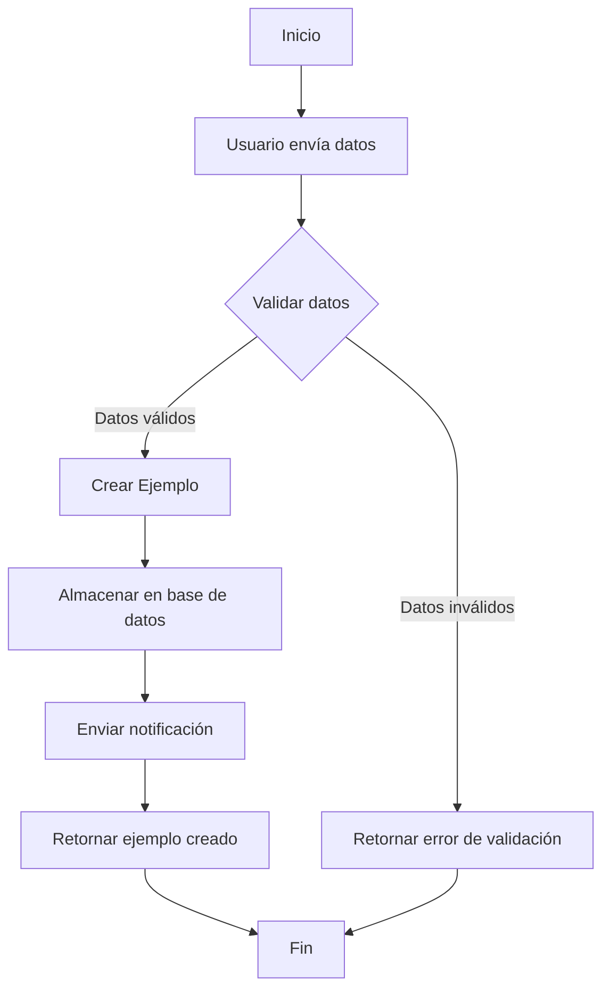
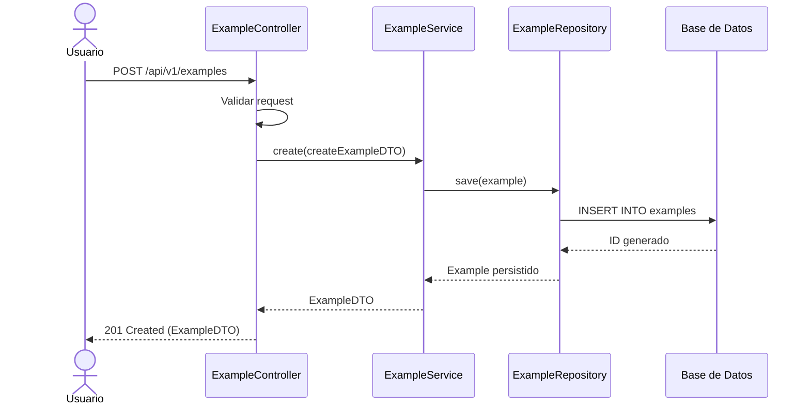
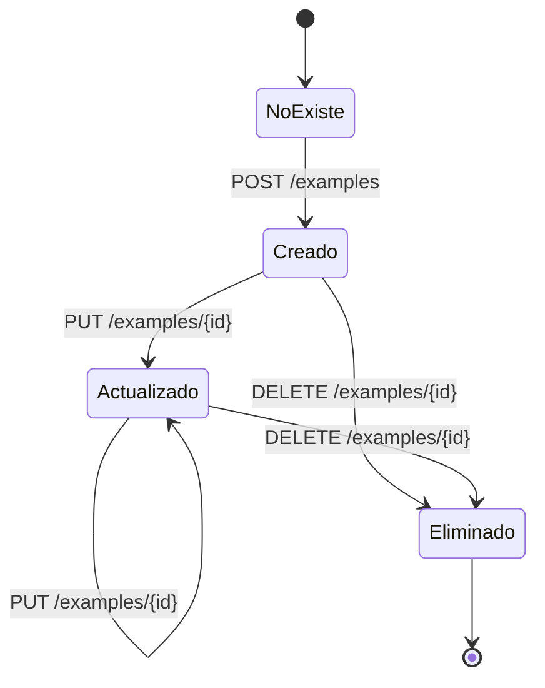

# Documentación Funcional

## Flujo: Creación y Actualización de Ejemplos

### Descripción General
Este flujo permite a los usuarios crear y posteriormente actualizar ejemplos en el sistema. El proceso incluye validación de datos, persistencia y notificación de los resultados.

### Actores
- Usuario de la API
- Sistema de almacenamiento
- Sistema de notificaciones (opcional)

### Precondiciones
- El usuario está autenticado y tiene permisos para crear/actualizar ejemplos
- El servicio está accesible y operativo

### Flujo Principal



### Pasos Detallados

#### 1. Creación de un Ejemplo

1.1. El usuario envía una petición POST a `/api/v1/examples` con los datos del ejemplo a crear:
```json
{
  "descripcion": "Nuevo ejemplo funcional"
}
```

1.2. El sistema valida los datos de entrada:
   - Verifica que la descripción no esté vacía
   - Verifica que la descripción no exceda los 255 caracteres

1.3. Si la validación es exitosa:
   - El sistema genera un nuevo ID para el ejemplo
   - Crea un registro en la base de datos
   - Retorna el ejemplo creado con su ID asignado
```json
{
  "id": 1,
  "descripcion": "Nuevo ejemplo funcional"
}
```

1.4. Si la validación falla:
   - El sistema retorna un mensaje de error indicando el problema
```json
{
  "timestamp": "2025-03-19T10:15:30.123Z",
  "status": 400,
  "error": "Bad Request",
  "message": "Errores de validación: descripcion: La descripción no puede estar vacía",
  "path": "/example-api/api/v1/examples",
  "errorCode": "EXAMPLE-400"
}
```

#### 2. Actualización de un Ejemplo

2.1. El usuario envía una petición PUT a `/api/v1/examples/{id}` con los datos a actualizar:
```json
{
  "descripcion": "Descripción actualizada del ejemplo"
}
```

2.2. El sistema verifica que el ejemplo existe:
   - Si existe, continúa con el proceso
   - Si no existe, retorna un error 404

2.3. El sistema valida los datos de entrada:
   - Aplica las mismas validaciones que en la creación

2.4. Si la validación es exitosa:
   - Actualiza el registro en la base de datos
   - Retorna el ejemplo actualizado
```json
{
  "id": 1,
  "descripcion": "Descripción actualizada del ejemplo"
}
```

### Casos Alternativos

#### A1. Ejemplo no encontrado durante la actualización
- **Condición**: El ID proporcionado no corresponde a un ejemplo existente
- **Acción**: El sistema retorna un error 404
```json
{
  "timestamp": "2025-03-19T10:15:30.123Z",
  "status": 404,
  "error": "Not Found",
  "message": "No se encontró el ejemplo con ID: 1",
  "path": "/example-api/api/v1/examples/1",
  "errorCode": "EXAMPLE-404"
}
```

#### A2. Error en la base de datos
- **Condición**: Ocurre un error al intentar acceder a la base de datos
- **Acción**: El sistema retorna un error 500 y registra el error en los logs

### Postcondiciones
- Si la operación es exitosa, el ejemplo es creado o actualizado en la base de datos
- Se genera una respuesta apropiada para el usuario

### Consideraciones Técnicas
- Todas las operaciones de base de datos se ejecutan dentro de una transacción
- Las validaciones se realizan mediante anotaciones de Bean Validation
- Las respuestas siguen el formato estándar de la API

### Diagramas

#### Diagrama de Secuencia para Creación de Ejemplo



#### Diagrama de Estados de un Ejemplo



### Pruebas Funcionales Recomendadas

| ID | Escenario | Datos de Entrada | Resultado Esperado |
|----|-----------|------------------|-------------------|
| TF01 | Crear ejemplo válido | `{"descripcion": "Test"}` | 201 Created, ejemplo creado |
| TF02 | Crear ejemplo inválido | `{"descripcion": ""}` | 400 Bad Request |
| TF03 | Actualizar ejemplo existente | `{"descripcion": "Updated"}` | 200 OK, ejemplo actualizado |
| TF04 | Actualizar ejemplo no existente | `{"descripcion": "Test"}` | 404 Not Found |
| TF05 | Obtener ejemplo existente | N/A | 200 OK, datos del ejemplo |
| TF06 | Obtener ejemplo no existente | N/A | 404 Not Found |
| TF07 | Eliminar ejemplo existente | N/A | 204 No Content |

### Anexos

#### Ejemplo de Implementación del Servicio

```java
@Service
@RequiredArgsConstructor
@Slf4j
public class ExampleServiceImpl implements ExampleService {

    private final ExampleRepository exampleRepository;
    private final ExampleMapper exampleMapper;
    
    @Override
    @Transactional
    public ExampleDTO create(CreateExampleDTO dto) {
        log.info("Creando nuevo ejemplo con descripción: {}", dto.getDescripcion());
        
        Example entity = exampleMapper.toEntity(dto);
        Example savedEntity = exampleRepository.save(entity);
        
        log.info("Ejemplo creado con ID: {}", savedEntity.getId());
        return exampleMapper.toDTO(savedEntity);
    }
    
    @Override
    @Transactional
    public ExampleDTO update(Integer id, UpdateExampleDTO dto) {
        log.info("Actualizando ejemplo con ID: {}", id);
        
        Example entity = exampleRepository.findById(id)
                .orElseThrow(() -> new ResourceNotFoundException("No se encontró el ejemplo con ID: " + id));
        
        exampleMapper.updateEntityFromDTO(dto, entity);
        Example updatedEntity = exampleRepository.save(entity);
        
        log.info("Ejemplo actualizado correctamente");
        return exampleMapper.toDTO(updatedEntity);
    }
    
    // Otros métodos del servicio...
}
```