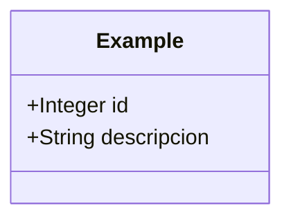
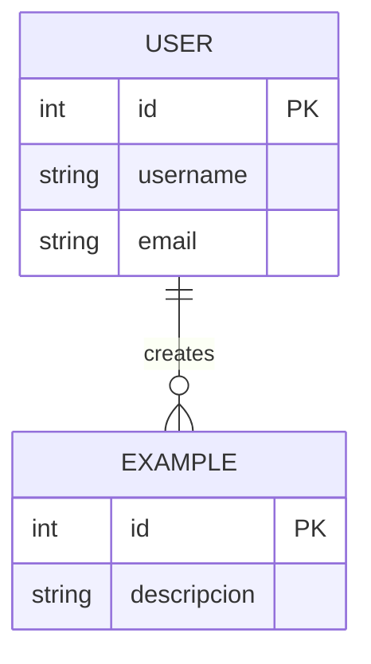

# Modelo de Datos

## Entidades

### Example

La entidad principal `Example` contiene la siguiente estructura:

```java
@Entity
@Table(name = "examples")
@Data
@NoArgsConstructor
@AllArgsConstructor
@Builder
public class Example {
    
    @Id
    @GeneratedValue(strategy = GenerationType.IDENTITY)
    private Integer id;
    
    @Column(nullable = false)
    private String descripcion;
}
```

#### Atributos

| Campo | Tipo | Descripción | Restricciones |
|-------|------|-------------|---------------|
| `id` | Integer | Identificador único | Clave primaria, autogenerado |
| `descripcion` | String | Descripción del ejemplo | No nulo |

## DTOs (Data Transfer Objects)

### ExampleDTO

```java
@Data
@NoArgsConstructor
@AllArgsConstructor
@Builder
public class ExampleDTO {
    private Integer id;
    private String descripcion;
}
```

### CreateExampleDTO

```java
@Data
@NoArgsConstructor
@AllArgsConstructor
@Builder
public class CreateExampleDTO {
    @NotBlank(message = "La descripción no puede estar vacía")
    private String descripcion;
}
```

### UpdateExampleDTO

```java
@Data
@NoArgsConstructor
@AllArgsConstructor
@Builder
public class UpdateExampleDTO {
    @NotBlank(message = "La descripción no puede estar vacía")
    private String descripcion;
}
```

## Diagramas de Modelo

### Diagrama de Entidades



### Diagrama de Relaciones (Para Futuras Expansiones)



## Validaciones

Las validaciones de datos se implementan usando las anotaciones de Bean Validation:

| Anotación | Campo | Descripción |
|-----------|-------|-------------|
| `@NotBlank` | descripcion | Asegura que la descripción no esté vacía |
| `@Size(max = 255)` | descripcion | Limita la longitud máxima |

## Conversiones

Para la conversión entre entidades y DTOs se utiliza el patrón Mapper:

```java
@Component
public class ExampleMapper {
    
    public ExampleDTO toDTO(Example entity) {
        if (entity == null) {
            return null;
        }
        
        ExampleDTO dto = new ExampleDTO();
        dto.setId(entity.getId());
        dto.setDescripcion(entity.getDescripcion());
        return dto;
    }
    
    public Example toEntity(CreateExampleDTO dto) {
        if (dto == null) {
            return null;
        }
        
        Example entity = new Example();
        entity.setDescripcion(dto.getDescripcion());
        return entity;
    }
    
    public void updateEntityFromDTO(UpdateExampleDTO dto, Example entity) {
        if (dto == null || entity == null) {
            return;
        }
        
        entity.setDescripcion(dto.getDescripcion());
    }
}
```